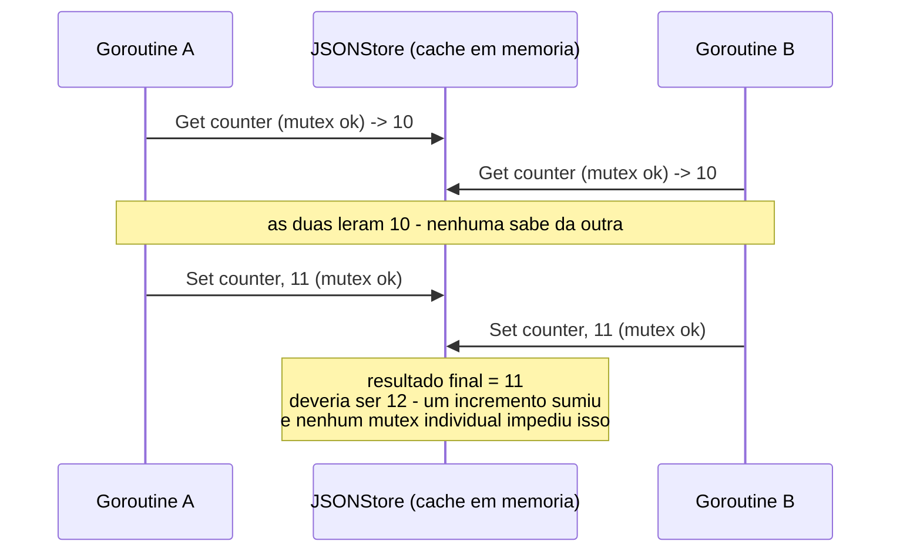

# Concorrência em mhl: o que acontece quando `FeatureStore` é acessado de fontes concorrentes

Continuação de
[`memory-lifecycle-featurestore.md`](memory-lifecycle-featurestore.md).
Lá, o ciclo de vida foi descrito assumindo acesso sequencial — um step de
cada vez, um processo de cada vez. Este documento testa o que quebra
quando essa suposição deixa de valer, usando o mesmo `FeatureStoreMemory`
(`memory { type: "json" }`) como alvo. Os números abaixo não são estimativa
— vieram de reproduções reais rodadas contra
`internal/features/memory/json.go` durante a escrita deste documento.

## Onde existe concorrência de verdade no runtime hoje

Uma busca por `go func`/`sync.WaitGroup` em todo `internal/engine` e
`internal/features` encontra exatamente **um** lugar que efetivamente
dispara goroutines: `cmd.exec_all` (`internal/features/nativeops/cmd.go`,
Fase 4 do `flows-development-mhl-gap-plan.md`) — e suas goroutines só
rodam subprocessos (`ExecArgs`), nunca tocam `JSONStore`/`KVStore`. Fora
disso, a execução de um pipeline é estritamente sequencial: um step por
vez (`Runner.Run`), uma iteração de loop por vez (`LoopRunner.Run`). Os
mutexes em `JSONStore`/`KVStore` (`sync.Mutex`, um em cada) não são
exercidos por nenhuma goroutine interna hoje — são defensivos, não uma
resposta a uma necessidade real do runtime atual.

Isso não significa que a pergunta seja irrelevante — significa que a
única forma de gerar concorrência de verdade contra `FeatureStoreMemory`
hoje é **de fora do processo mhl**: duas invocações de `mhl run`
apontando pro mesmo diretório `.mhl/`, ao mesmo tempo. É esse o cenário
testado abaixo — e o segundo teste mostra que o problema aparece mesmo
sem sair do processo, bastando duas goroutines usando a mesma instância.

## Teste 1 — duas "instâncias de processo" concorrentes (o cenário real)

Simulação: duas goroutines, cada uma com seu **próprio** `JSONStore`
(exatamente o que aconteceria em dois `mhl run` separados), cada uma
incrementando `"counter"` 50 vezes, mirando o mesmo arquivo.

```go
increment := func() {
    store := memory.NewJSONStore() // como um `mhl run` novo faria
    for i := 0; i < 50; i++ {
        cur, _ := store.Get(path, "counter", 0.0)
        store.Set(path, "counter", cur.(float64)+1)
    }
}
go increment() // "processo A"
go increment() // "processo B"
```

**Resultado real:** esperado 100, obtido **50** — exatamente metade dos
incrementos, perdidos.

A causa não é só timing — é estrutural. `JSONStore.load` (`json.go`)
cacheia o conteúdo do arquivo na *primeira* leitura por instância e nunca
relê depois disso:

```go
func (s *JSONStore) load(path string) (map[string]any, error) {
    if data, ok := s.caches[path]; ok {
        return data, nil   // nunca volta ao disco depois da 1ª vez
    }
    ...
}
```

Cada instância carrega o arquivo uma vez, e daí em diante só enxerga e
escreve a própria cópia em memória — nunca vê o que a outra instância já
gravou. Não é uma corrida "quem escreve por último ganha, às vezes";
é garantido que cada instância sobrescreve cegamente o que a outra fez,
porque nenhuma das duas nunca mais olha o disco.

## Teste 2 — mesma instância, mesmo processo, ainda perde dado

Se o problema fosse só "cada processo tem seu próprio cache", bastaria
uma instância `JSONStore` compartilhada dentro do processo pra resolver.
Não basta:

```go
store := memory.NewJSONStore() // UMA instância compartilhada
increment := func() {
    for i := 0; i < 200; i++ {
        cur, _ := store.Get(path, "counter", 0.0)
        store.Set(path, "counter", cur.(float64)+1)
    }
}
go increment()
go increment()
```

**Resultado real** (rodado com `go test -race`, sem nenhum data race
reportado): esperado 400, obtido **353** — 47 incrementos perdidos, com o
detector de corrida do Go completamente satisfeito.

Isso é o ponto mais importante deste documento: **não existe data race no
sentido do Go** (o mutex protege corretamente o mapa interno — `-race`
não acusa nada), mas existe uma corrida lógica, porque `Get` e `Set` são
duas operações atômicas *separadas*, não uma única operação atômica de
"ler, somar, gravar". Entre o `Get` de uma goroutine terminar e o `Set`
dela começar, a outra goroutine pode completar seu próprio ciclo
`Get`→`Set` inteiro — e o incremento dela é perdido quando a primeira
goroutine grava por cima com um valor calculado a partir de um dado já
desatualizado.



`KVStore` (`memory { type: "kv" }`, sem disco) tem exatamente o mesmo
formato de API — `Get` e `Set` como chamadas separadas, cada uma
protegida por mutex — logo carrega o mesmo risco lógico, mesmo sem
nenhum arquivo envolvido. O problema não é I/O; é a forma da API.

## Um segundo risco, independente: escrita não-atômica em disco

`writeJSON` (`json.go:143`) grava direto no arquivo final:

```go
if err := os.WriteFile(path, raw, 0o644); err != nil { ... }
```

Compare com `Checkpoint.Save` (`internal/engine/runtime/state.go:99-112`),
que já resolve exatamente esse problema pra outro tipo de estado
persistido (o checkpoint de resume de pipeline): escreve num `.tmp` e só
depois faz `os.Rename` pro caminho final — um rename é atômico no nível
do sistema de arquivos, então quem lê nunca vê um arquivo pela metade.
`writeJSON` não faz isso. Duas consequências práticas:

- Um leitor concorrente (outro processo, ou uma ferramenta externa lendo
  `.mhl/feature_list.json` enquanto o mhl escreve) pode, em teoria, ver
  um arquivo truncado ou parcialmente escrito.
- Se o processo morre exatamente no meio do `os.WriteFile`, o arquivo
  pode ficar corrompido — não existe uma cópia "última versão válida"
  como sobra do padrão tmp+rename.

Isso é independente do problema de lost update dos testes acima: mesmo
com UM único escritor, sem concorrência nenhuma, essa escrita não é seguro
contra crash-no-meio-do-caminho da forma que o checkpoint já é.

## Onde isso importa de verdade, hoje

| Cenário | Seguro? | Por quê |
|---|---|---|
| Um `mhl run` de cada vez, um step de cada vez (o modelo atual) | Sim | Não há concorrência real tocando memory — o mutex nunca é contestado |
| `cmd.exec_all` rodando comandos em paralelo dentro de um step | Sim | As goroutines só executam subprocessos; nenhuma toca `JSONStore`/`KVStore` |
| Dois `mhl run` concorrentes apontando pro mesmo `.mhl/` (mesmo `path`) | **Não** | Teste 1 acima — updates perdidos de forma garantida, não probabilística |
| Um futuro recurso que rode steps/agents em paralelo dentro de um processo | **Não**, mesmo com o mutex atual | Teste 2 acima — `Get`+`Set` não é atômico como par, só individualmente |
| Leitura de `.mhl/feature_list.json` por uma ferramenta externa enquanto o mhl escreve | Potencialmente não | `writeJSON` não é atômico (sem tmp+rename) |

O modelo de execução atual do mhl (sequencial, um processo por vez) é
exatamente o que mantém isso invisível na prática — não porque o
problema foi resolvido, mas porque a única forma de expô-lo hoje é rodar
dois `mhl run` ao mesmo tempo contra o mesmo diretório de estado, o que o
próprio design do harness (um `.mhl/` por execução, pensado para um
processo de cada vez) não incentiva. Ele deixaria de ser hipotético no
mesmo instante em que qualquer um dos dois cenários "não seguro" da
tabela virasse realidade — paralelismo real de steps/agents, ou execução
concorrente intencional (dois `mhl run` do mesmo projeto, por exemplo em
CI rodando testes em paralelo que compartilham `.mhl/`).
