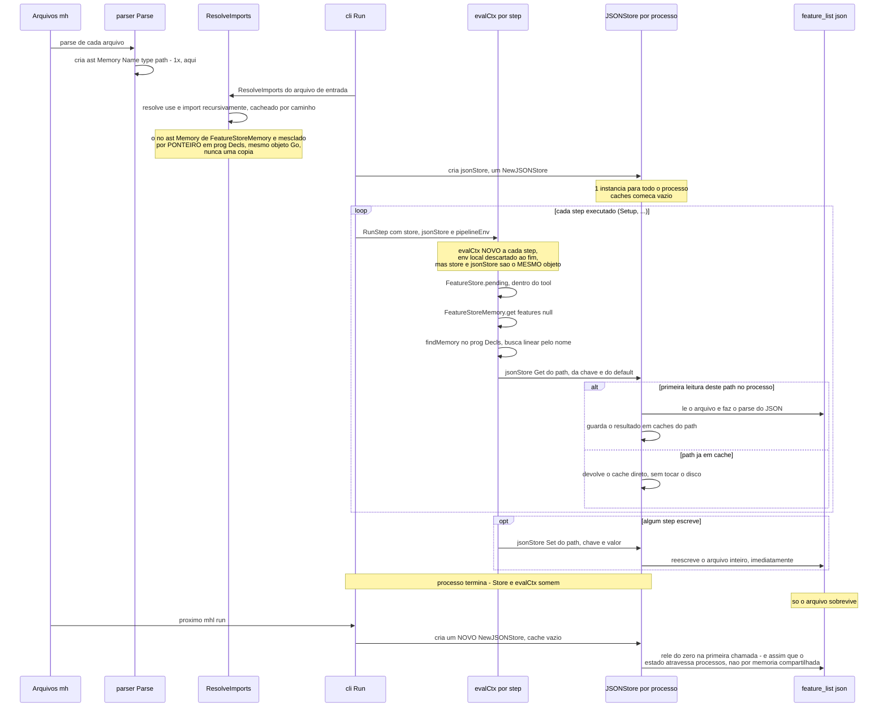
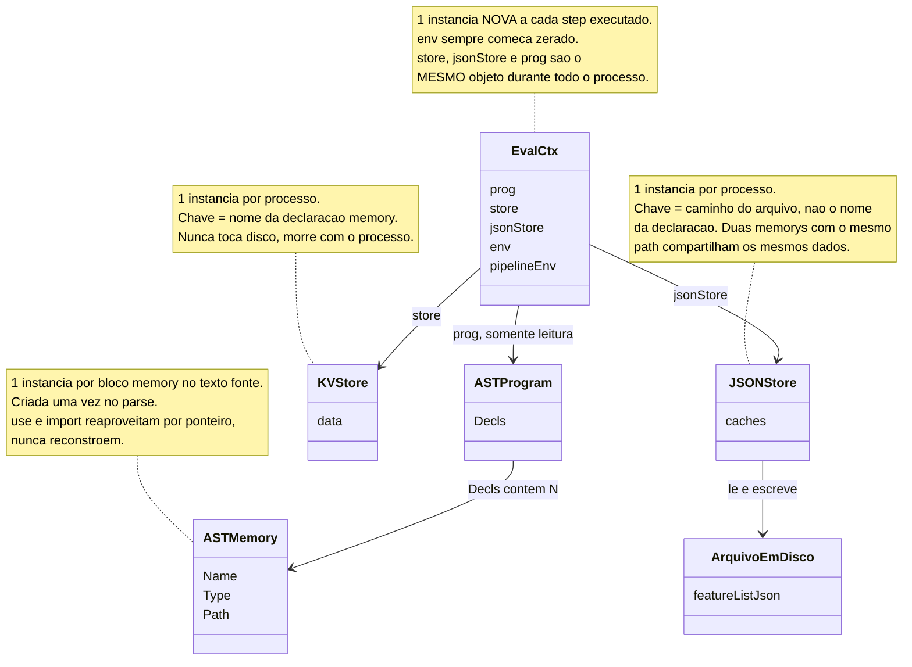

# Gerenciamento de memória em mhl: o caso `FeatureStore`

Como um componente `memory` do mhl é representado e gerenciado durante a
execução — da leitura do código-fonte até a persistência em disco — usando
o par `FeatureStoreMemory`/`FeatureStore` de
`test/e2e/scenarios/modules/` como exemplo real.

## O exemplo

```mhl
// modules/memory.mh
export memory FeatureStoreMemory {
    type: "json"
    path: ".mhl/feature_list.json"
}

// modules/tools.mh
use {FeatureStoreMemory} from "memory.mh"

export tool FeatureStore {
    pending() -> {
        var features = FeatureStoreMemory.get("features", null)
        if (features == null) { return 0 }
        return features.filter((f) -> f.status == "pending").size()
    }
}

// development_feature_cycle.mh
use {FeatureStore} from "./modules/tools.mh"

export pipeline FeatureCycle {
    step Setup {
        if (FeatureStore.pending() > 0) { ... }
    }
}
```

Duas coisas com o nome "FeatureStore" existem aqui, e são coisas
completamente diferentes:

1. **`FeatureStoreMemory`** — a declaração `memory`, estática, existe uma
   vez no texto-fonte.
2. **O dado de verdade** — o conteúdo de `.mhl/feature_list.json`, que vive
   fora do processo mhl, em disco.

Entre as duas há uma camada de runtime (`JSONStore`) que é *ela própria*
uma instância, com seu próprio ciclo de vida — distinto tanto da declaração
quanto do arquivo. É essa distinção de três camadas que este documento
mapeia.

## As três camadas

| Camada | O que é | Quantas instâncias existem | Quem cria | Quando morre |
|---|---|---|---|---|
| Declaração (`ast.Memory`) | Nó AST estático — nome, `type`, `path` | 1 por bloco `memory { }` no texto-fonte, para sempre reaproveitado por ponteiro (nunca reconstruído) | `parser.Parse` | Quando o processo `mhl` termina |
| Store de runtime (`JSONStore`/`KVStore`) | Objeto Go que sabe ler/escrever os dados | 1 por processo (`mhl run`/`mhl test`), compartilhado por todos os steps dessa execução | `cli.go`, uma vez, antes do primeiro step | Quando o processo `mhl` termina |
| Dado persistido | O JSON em `.mhl/feature_list.json` | 1 arquivo em disco | Escrito por `JSONStore.Set`/`SetAll`/`Remove` | Sobrevive ao processo — é o único que atravessa execuções |

A confusão mais comum é achar que "a instância de `FeatureStoreMemory`" é
uma coisa só, com um ciclo de vida único. Na prática, a declaração nunca
guarda estado nenhum — ela só carrega `type`/`path`. Todo o estado real
mora na store de runtime (enquanto o processo vive) e no arquivo (depois
que ele termina).

## Diagrama 1 — linha do tempo (parse → resolve → execução → disco)



## Diagrama 2 — quem é dono de quê, dentro de um processo



## Três consequências práticas dessa arquitetura

**1. A declaração nunca é "a instância" — é só configuração.**
`findMemory(ctx.prog, "FeatureStoreMemory")` faz uma busca linear pelo NOME
em `prog.Decls` toda vez que `.get()`/`.set()` é chamado — não existe
cache de "qual declaração eu já resolvi". Isso é barato (a lista de
declarações é pequena), mas depende de `FeatureStoreMemory` de fato estar
em `prog.Decls` no momento da chamada: como o `tool FeatureStore` só
consegue essa declaração porque `use`a de um terceiro arquivo
(`modules/memory.mh`), a resolução de `use` precisa ser transitiva —
mesclar não só o nome pedido, mas o que esse módulo por sua vez importa
(`internal/engine/interpreter/imports.go`) — ou essa busca falha em
runtime mesmo que o `.mh` tenha compilado/parseado sem erro.

**2. Quem identifica os dados é o `path`, não o nome da declaração.**
`JSONStore.caches` é `map[path]map[key]value` — não
`map[nomeDaDeclaração]...`. Duas declarações `memory` diferentes, em
arquivos diferentes, com o mesmo `path: ".mhl/feature_list.json"`,
compartilham exatamente o mesmo dado (o comentário no próprio
`json.go` documenta essa decisão: "Data is cached per path so multiple
memory declarations pointing at the same path correctly share one
underlying file"). Isso é o oposto do `KVStore`, que é `map[nome]...` —
duas `memory { type: "kv" }` com nomes diferentes NUNCA colidem, mesmo que
"pareçam" a mesma coisa.

**3. Continuidade entre processos vem só do disco.**
Dentro de um processo, `store`/`jsonStore` são passados por referência a
cada `RunStep` — mudanças feitas num step aparecem no próximo
imediatamente, sem reler nada (o cache em memória já tem o valor). Mas
entre duas invocações de `mhl run` não existe nenhum objeto Go sobrevivendo
— o próximo processo cria um `JSONStore` novo, com cache vazio, e só
recupera o estado porque relê o arquivo do zero na primeira chamada. É
por isso que `type: "kv"` (sem `path`, sem disco) nunca sobrevive a um
`mhl run` novo, e `type: "json"` sempre sobrevive — a diferença inteira
está em qual das duas tem uma camada de arquivo por baixo.
