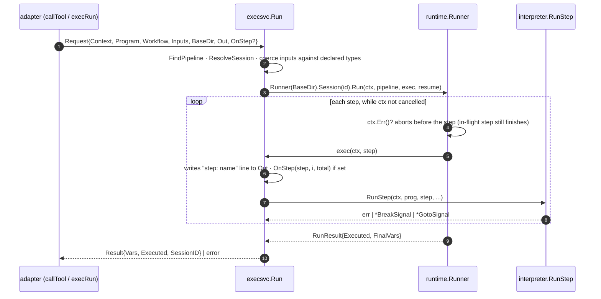
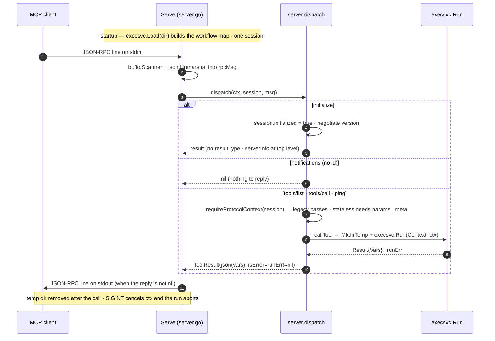
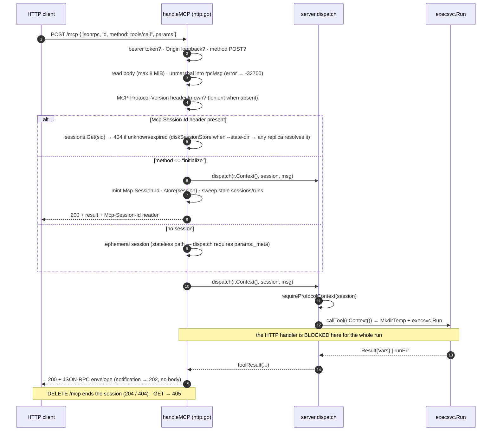

# `mcpserver` — end-to-end request flow

Three ways to invoke the same workflows. All converge on `execsvc.Run`; what
differs is the transport and **who waits for the run to finish**.

| Flow | Transport | Blocks the client? | Per-step progress? |
|---|---|---|---|
| 1. stdio | one JSON-RPC line on stdin/stdout | yes (one message at a time) | no |
| 2. HTTP synchronous (`tools/call`) | `POST /mcp` | yes, for the whole run | no |
| 3. HTTP asynchronous (`run/*`) | `POST /mcp` | no — returns a `runId` | yes, via `run/status` |
| 3b. HTTP async via control tools (`mhl_run_*`) | `POST /mcp` → `tools/call` | no — returns a `runId` | yes, via `mhl_run_status` |

HTTP server config: default bind `127.0.0.1:8711`; `--token` /
`MHL_SERVE_TOKEN` turns on `Authorization: Bearer`; `--principal-header` /
`MHL_SERVE_PRINCIPAL_HEADER` (requires `--token`) keys run ownership on a
verified principal from that header; `Origin`, when sent, must be loopback.
`--state-dir` / `MHL_SERVE_STATE_DIR` persists async run state across a restart. `--drain-timeout` / `MHL_SERVE_DRAIN_TIMEOUT` (default 0 =
cancel at once) gives in-flight async runs that long to finish on SIGTERM.
`--max-concurrent-runs` / `MHL_SERVE_MAX_CONCURRENT_RUNS` (default 0 =
unlimited) bounds executing runs; extras are `queued`.

Per-method paths: `POST /mcp/<method>` (`/mcp/run/resume`, `/mcp/tools/call`, …)
run the identical dispatch as `POST /mcp`, but let an Istio `AuthorizationPolicy`
/ API Gateway route / WAF rule match one method without parsing the JSON-RPC
body. The body's `method` stays authoritative; a mismatch is `-32600` (400).
POST-only (no DELETE); `GET` → 405.

Operational endpoints, unauthenticated: `GET /healthz` (liveness, always 200
while up), `GET /readyz` (200, or 503 once draining), `GET /metrics`
(Prometheus text — run counters, duration sum/count, tool-call counters, and
live `runs_active` / `runs_queued` / `sessions_active` gauges; 404 if a
non-Prometheus `MetricsSink` is configured). Lifecycle events also go to
stderr as JSON (`log/slog`), keyed by `runId` and `owner`.

---

## Shared core — `execsvc.Run`

Every `tools/call` / `run/start` ends up here. `Request` carries `Context`
(cancels the run at the next step boundary), `BaseDir` (the run's own
`.mhl/` state tree), `Out` (diagnostics), and — in flow 3 — `OnStep`.



---

## Flow 1 — stdio (`mhl serve mcp <dir>`)

`cli.runServeMCP` without `--http` calls `mcpserver.Serve(ctx, dir,
os.Stdin, os.Stdout, os.Stderr)`. `ctx` is the signal context
(SIGINT/SIGTERM). A single `session` lives for the whole process; messages
are handled in order, one at a time.



---

## Flow 2 — HTTP synchronous (`POST /mcp` → `tools/call`)

`cli.runServeMCP --http` calls `mcpserver.ServeHTTP(ctx, addr, dir, token,
logw)`. `http.Server.BaseContext` ties `r.Context()` to the server context,
so **client disconnect OR shutdown** cancels the run.



---

## Flow 3 — HTTP asynchronous (`run/start` → `run/status` → `run/cancel`)

`run/*` is routed in `handleMCP` **before** `dispatch` (it is HTTP-only — it
needs the `h.runs` registry). It passes the same protocol-context gate as
`tools/*`. Because it is HTTP-only, the HTTP transport sets `server.asyncRuns`,
so `initialize` / `server/discover` advertise the family under
`capabilities.experimental["mhl.run"]` (`{version, methods:[run/start…]}`) and
each `tools/list` entry carries `_meta.mhl.run` — a client discovers that a long
pipeline must use `run/start` instead of a blocking `tools/call`. Over stdio,
where `run/*` is not routed, neither is present.

**Control tools (Flow 3b).** A stock MCP client (VS Code, Claude Desktop) can
only send `tools/call`, never a custom `run/*` method — so the HTTP `tools/list`
also carries six synthetic tools, `mhl_run_start` / `mhl_run_status` /
`mhl_run_resume` / `mhl_run_cancel` / `mhl_run_list` / `mhl_run_logs`
(`runtools.go`). In `serveMCP`, right after the body is parsed, a `tools/call`
whose name is one of these is rewritten in place: `msg.Method` becomes the
matching `run/*`, `msg.Params` becomes `bridgeRunToolParams(...)` (for
`mhl_run_start`, `{workflow}` → `{name}`; for the rest the arguments object is
already the `run/*` params; the original `params._meta` is carried across so the
protocol-context gate still sees it). It then flows through the ordinary `run/*`
routing below, and `asToolResult` re-frames the reply as a `CallToolResult`
(`structuredContent` = the run-status object, plus a pretty-printed text block); a
`-32602` stays a JSON-RPC error. The rewrite happens before the drain / slot
checks, so `mhl_run_start` is refused while draining exactly like `run/start` and
never takes the synchronous `tools/call` slot. `runToolMethod` /
`asyncRunMethods` are the two lists to extend when adding a `run/*` method.

The run lives in a goroutine whose context descends from
`h.runsCtx`, **not** from `r.Context()`. `runsCtx` is deliberately detached from
the SIGINT/SIGTERM context (`context.WithoutCancel` in `buildHTTP`): a signal
alone does not stop an async run — only `drain()` (`runsCancel`, gated by
`--drain-timeout`) or a per-run `cancel()` (`run/cancel`, shutdown) does.

**Across replicas** (`h.cps.Shared()` — a `--state-dir` on shared storage, or an
extension store): `execRun` publishes a `RunStatusRec` (state + current step) to
the store each `OnStep`, so another replica's `run/status` reconstructs a
`working` run it never started and its `run/cancel` writes a `cancel` flag under
`run/<id>/` that the owning replica observes (a 1 s `watchRemoteCancel` poll +
each step boundary) and turns into a local `cancel()`. `reconstructRun` falls
back to the status record when there is no checkpoint (a run without `per_step`
still working elsewhere); such a run is marked `remote` and `run/status`
re-reads the record on each poll. The `h.runs` registry itself stays
process-local.


### `asyncRun` states

```
queued  ──▶ working           (a concurrency slot freed — see --max-concurrent-runs)
        └─▶ canceled          (run/cancel or shutdown while still waiting for a slot)

working ──▶ completed         (run finished with no error — state dir removed)
        ├─▶ failed            (runErr != nil and ctx not cancelled — resumable if a checkpoint is on disk;
        │                      a step's `timeout <dur>` clause elapsing lands here, `error` wraps
        │                      runtime.ErrStepTimeout, and a resume re-enters the step with a fresh budget)
        └─▶ canceled          (run/cancel, or runErr with ctx cancelled)

failed / canceled ──▶ queued|working   (run/resume, when the workflow has a per_step checkpoint)
```

A run starts `working` immediately unless `--max-concurrent-runs` is set and
every slot is taken — then it is `queued` and `run/status` reports its
`queuePosition` (0 = next up). A synchronous `tools/call` does not queue: it
holds the client connection while it waits up to ~5s for a slot, then either
runs or returns `-32000` "server at capacity".

`reached` is the ordered list of steps that **started** (fed by `OnStep`);
on completion it becomes `Result.Skipped ++ Result.Executed` (authoritative,
and across a resume it includes the steps the resume skipped over). `vars`
appears only in `completed`; `error` only in `failed` / `canceled`;
`resumable` only when `run/resume` can continue the run; `queuePosition` only
while `queued`.

`run/logs { runId, since? }` returns `{ text, nextSince, dropped? }` — this
run's own ~64 KiB rolling copy of its `step:` / `log()` output, cursored by
byte offset (poll with the previous `nextSince`). Owner-gated like
`run/status`. A run reconstructed from disk after a restart has an empty
buffer (its output happened in the previous process). The same output is also
written to the server's stderr diagnostics sink.

### Resources (`resources.go`)

Read-only detail, addressed by `mhl://` URI, behind the `resources` capability
(advertised on both transports):

- `mhl://workflow/<name>` — a JSON manifest projected from the loaded
  `execsvc.Workflow` / `runtime.Pipeline` (`workflowManifest`): ordered steps,
  typed inputs, `inputSchema`, checkpoint config, parallel groups, step
  timeouts, loop config, and the program's `declared` agents/tools/memory/…
- `mhl://workflow/<name>/source` — the declaration's `.mh` text.
- `mhl://run/<id>/logs` and `.../result` — an async run's `ringLog` output and
  `runView` JSON. **HTTP-only** (need the registry) and owner-gated exactly
  like `run/status`.

`resources/list` + `resources/read` are cases in the shared `server.dispatch`
(gated by `requireProtocolContext`); `dispatch`'s `readResource` only serves
`mhl://workflow/*`. `serveMCP` intercepts first: `resources/list` there returns
`workflowResourceList(...)` ++ `h.runResourceList(sess)`, and a `resources/read`
whose `uri` is `mhl://run/*` (`isRunResourceURI`) goes to `h.readRunResource`
before `dispatch` sees it. `asToolResult` also appends `resource_link` items
(logs + result) to any bridged `mhl_run_*` reply that carries a `runId`. Adding
a resource kind → `workflowResourceList` / `readWorkflowResource` (or the run
pair) plus the URI constants.

### Identity & ownership

`handleMCP` runs a `TokenVerifier` (verifier.go) on every request: `staticToken`
(the historical `Authorization: Bearer <--token>` check, principal `""`) or —
with `--principal-header` — `trustedHeader`, which requires that bearer check to
pass *and then* reads the principal from the named header (set by an upstream
authorizer; see `tests/cloud/README.md`). serve.go refuses `--principal-header`
without `--token`.

`rn.owner` = `httpServer.ownerOf(session)` — `sha256("principal:"+p)` when the
verifier produced a principal `p`, else the Phase-0 `sha256(Mcp-Session-Id)`
fallback (so a plain `--token` / no-verifier deployment is unchanged; stateless
callers still share the `""` owner). `ownedRun` gates `run/status` /
`run/resume` / `run/cancel` / `run/logs`, and `run/list` filters to the
caller's own runs; a non-owner is answered exactly like an unknown `runId`
(`-32602`), so the method is not an existence oracle.

For a principal-owned run the owner is persisted to `<runId>/owner`
(`CheckpointStore.WriteOwner`), so after a restart `reconstructRun` hands the run
back only to that same principal — a different caller naming the `runId` gets
`-32602`. A session-hash owner is *not* persisted (each process mints fresh
session ids), so there the historical "first caller to name the `runId`
reclaims it" still applies.

`context.principal` (a `context:` block) exposes the raw verified identity of
the current leg's caller (the starter, or the resumer) to the workflow — for
audit, not authorization.

### Persistence

Async run state lives under `<runsDir>/.mhl/state/<runId>/`. `runsDir` is
`--state-dir` / `MHL_SERVE_STATE_DIR` when given (durable — a later process
`run/status`/`run/resume`s a `runId` it never started, via `reconstructRun`),
otherwise a per-process temp dir removed on shutdown. Checkpoints are only
written when the workflow declares `checkpoint { strategy: "per_step" }` — one
small JSON file (`tmp` + `rename`) per completed step, sized by the pipeline's
variable state. `run/status` on a live run stays a pure in-memory read; disk
is touched only on `run/resume` or a status poll after the registry entry is
gone.

A caller `--state-dir` also puts **protocol sessions** on shared storage:
`diskSessionStore` (`store.go`) writes one JSON file per id under
`<runsDir>/.mhl/state/sessions/`, so an `Mcp-Session-Id` minted by `initialize`
on one replica is a resolvable session on any other pointed at the same dir —
no forced re-`initialize`, and a `run/start` on pod A is visible to
`run/status` on pod B using that same session (the owner check then runs as
usual). No `--state-dir` keeps `memSessionStore` (process-local).

**External store (Phase 3a).** When the workflow directory declares one
`extension store <Name> { dir: ... }`, `mhl serve mcp --http` binds that
extension (host-side, not via the interpreter) and routes durable state
through it instead of `.mhl/state`: an `extStateStore` intercepts the Runner's
per-step checkpoints (`runtime.StateStore`, injected via
`execsvc.Request.StateStore`), `extCheckpointStore` serves the
reconstruct/owner path, and `extSessionStore` holds sessions — all as
`get`/`put`/`delete`/`list` calls on `run/<id>/…` and `session/<id>` keys.
The **run registry stays in-memory per pod**: another pod still
`reconstructRun`s a run from the shared store, but live cross-pod
cancel/progress is Phase 4. `--state-dir` is then only a scratch path for the
interpreter's own working files.
