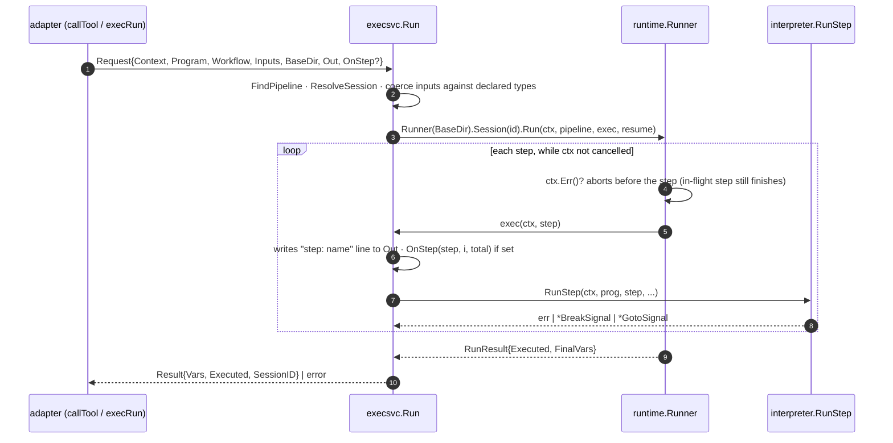
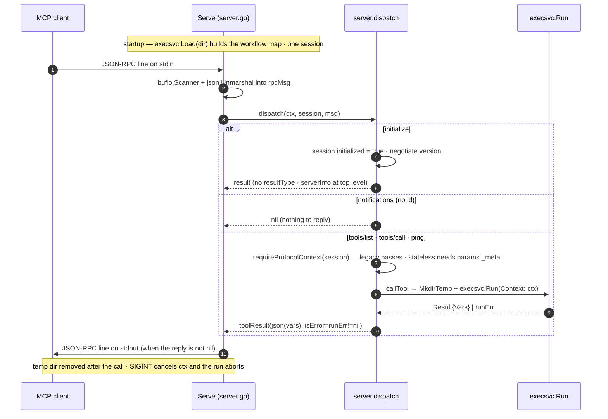
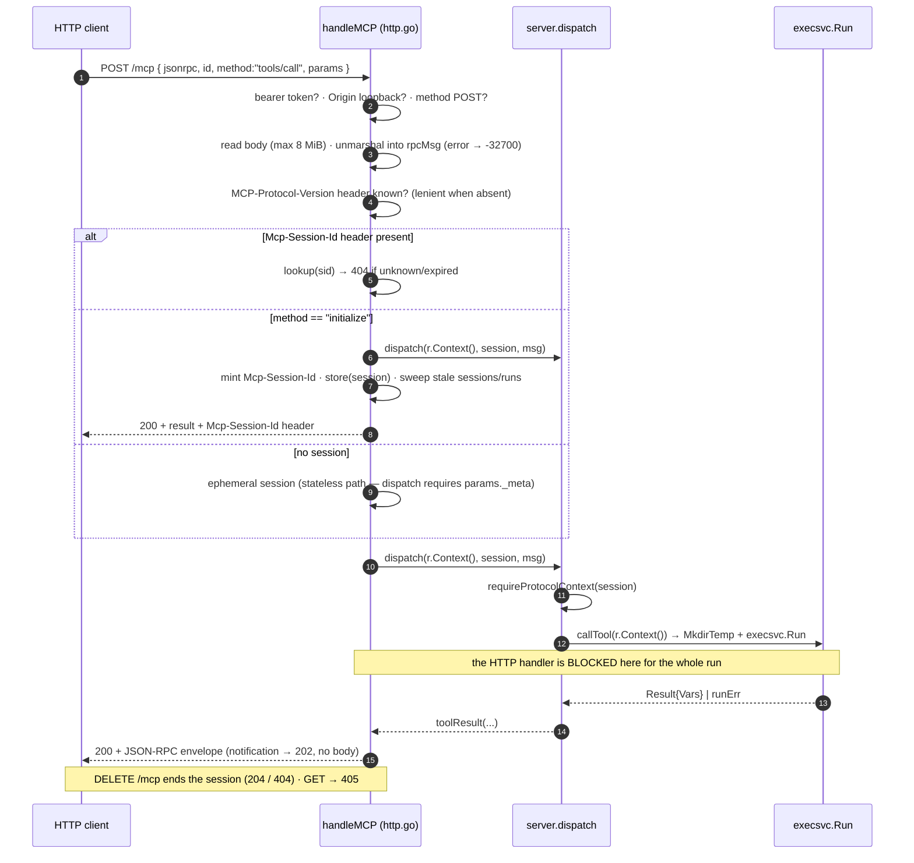
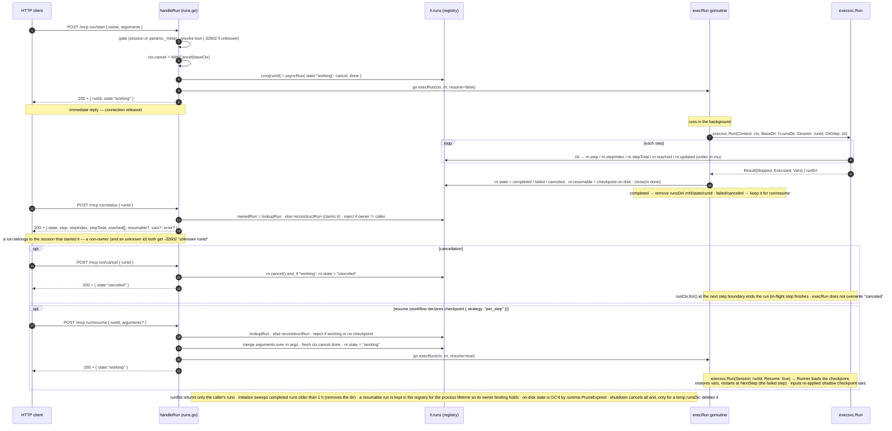

# `mcpserver` — end-to-end request flow

Three ways to invoke the same workflows. All converge on `execsvc.Run`; what
differs is the transport and **who waits for the run to finish**.

| Flow | Transport | Blocks the client? | Per-step progress? |
|---|---|---|---|
| 1. stdio | one JSON-RPC line on stdin/stdout | yes (one message at a time) | no |
| 2. HTTP synchronous (`tools/call`) | `POST /mcp` | yes, for the whole run | no |
| 3. HTTP asynchronous (`run/*`) | `POST /mcp` | no — returns a `runId` | yes, via `run/status` |

HTTP server config: default bind `127.0.0.1:8711`; `--token` /
`MHL_SERVE_TOKEN` turns on `Authorization: Bearer`; `Origin`, when sent, must
be loopback.

---

## Shared core — `execsvc.Run`

Every `tools/call` / `run/start` ends up here. `Request` carries `Context`
(cancels the run at the next step boundary), `BaseDir` (the run's own
`.mhl/` state tree), `Out` (diagnostics), and — in flow 3 — `OnStep`.



---

## Flow 1 — stdio (`mhl serve mcp <dir>`)

`cli.runServeMCP` without `--http` calls `mcpserver.Serve(ctx, dir,
os.Stdin, os.Stdout, os.Stderr)`. `ctx` is the signal context
(SIGINT/SIGTERM). A single `session` lives for the whole process; messages
are handled in order, one at a time.



---

## Flow 2 — HTTP synchronous (`POST /mcp` → `tools/call`)

`cli.runServeMCP --http` calls `mcpserver.ServeHTTP(ctx, addr, dir, token,
logw)`. `http.Server.BaseContext` ties `r.Context()` to the server context,
so **client disconnect OR shutdown** cancels the run.



---

## Flow 3 — HTTP asynchronous (`run/start` → `run/status` → `run/cancel`)

`run/*` is routed in `handleMCP` **before** `dispatch` (it is HTTP-only — it
needs the `h.runs` registry). It passes the same protocol-context gate as
`tools/*`. The run lives in a goroutine whose context descends from
`h.baseCtx` (the server lifetime), **not** from `r.Context()`.



### `asyncRun` states

```
working ──▶ completed        (run finished with no error — state dir removed)
        ├─▶ failed           (runErr != nil and ctx not cancelled — resumable if a checkpoint is on disk)
        └─▶ canceled         (run/cancel, or runErr with ctx cancelled)

failed / canceled ──▶ working   (run/resume, when the workflow has a per_step checkpoint)
```

`reached` is the ordered list of steps that **started** (fed by `OnStep`);
on completion it becomes `Result.Skipped ++ Result.Executed` (authoritative,
and across a resume it includes the steps the resume skipped over). `vars`
appears only in `completed`; `error` only in `failed` / `canceled`;
`resumable` only when `run/resume` can continue the run.

### Ownership

`rn.owner` = `sha256(Mcp-Session-Id)` of the session that ran `run/start`
(hashed so a leaked run view carries no usable session credential). `ownedRun`
gates `run/status` / `run/resume` / `run/cancel`, and `run/list` filters to
the caller's own runs; a non-owner is answered exactly like an unknown
`runId` (`-32602`), so the method is not an existence oracle. Stateless
callers have no session, so `owner` is `""` and all stateless callers share
it — stateless mode has no per-caller isolation. After a restart the owner
session no longer exists; `reconstructRun` then claims the run for the first
caller that names the (128-bit, unguessable) `runId`.

### Persistence

Async run state lives under `<runsDir>/.mhl/state/<runId>/`. `runsDir` is
`--state-dir` / `MHL_SERVE_STATE_DIR` when given (durable — a later process
`run/status`/`run/resume`s a `runId` it never started, via `reconstructRun`),
otherwise a per-process temp dir removed on shutdown. Checkpoints are only
written when the workflow declares `checkpoint { strategy: "per_step" }` — one
small JSON file (`tmp` + `rename`) per completed step, sized by the pipeline's
variable state. `run/status` on a live run stays a pure in-memory read; disk
is touched only on `run/resume` or a status poll after the registry entry is
gone.
